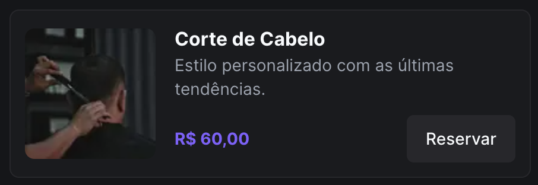

# Front-end Test by Zion/Dunamis

Este é um projeto de teste para avaliação de habilidades no desenvolvimento de front-end, utilizando Next.js, Tailwind CSS e outras tecnologias complementares. O objetivo principal é criar uma aplicação que liste os serviços oferecidos por uma barbearia, permitindo a filtragem, tratamento de cenários de erro e carregamento da página, além de criar uma rota para exibir detalhes do serviço quando selecionado.

## Layout do Card

O layout do card deve ser seguido conforme a imagem acima, proporcionando uma experiência visual agradável para o usuário.

## Funcionalidades Principais

1.  Listagem de Serviços

    - Exibir uma lista dos serviços oferecidos pela barbearia.
    - Cada serviço deve ser representado por um card com a imagem, nome e breve descrição.

2.  Filtragem de Serviços:

    - Incluir um campo de busca para filtrar os serviços conforme o usuário digita.
    - Os resultados devem ser atualizados em tempo real, sem a necessidade de recarregar a página.

3.  Tratamento de Cenários de Erro:

    - Lidar com situações de erro, como falhas na busca por serviços ou falhas na conexão com a API.
    - Apresentar mensagens amigáveis ao usuário para indicar problemas e orientá-lo sobre como proceder.

4.  Carregamento da Página:

    - Proporcionar uma experiência de carregamento suave e amigável para o usuário.
    - Utilizar indicadores visuais para informar o estado de carregamento da página ou de operações assíncronas.

5.  Extras:

    - Ao clicar em um serviço, criar uma nova rota para exibir detalhes específicos desse serviço.
    - Os detalhes podem incluir informações mais detalhadas, imagens adicionais, preços, etc.

## Tecnologias Utilizadas

- Next.js: Framework React para aplicações web.
- Tailwind CSS: Framework de estilização CSS utilitária para uma abordagem eficiente e consistente.
- Outras Tecnologias Necessárias: Pode-se utilizar outras bibliotecas e ferramentas conforme necessário para atingir os objetivos propostos.

## Como Iniciar o Projeto

1. Clone este repositório.
2. Instale as dependências utilizando o comando `npm install` ou `yarn install`.
3. Execute o projeto localmente com `npm run dev` ou `yarn dev`.

## Considerações Finais

Este teste não apenas avalia suas habilidades técnicas, mas também sua capacidade de criar uma aplicação intuitiva e de fácil utilização. Sinta-se à vontade para adicionar melhorias e personalizações, mostrando seu estilo e criatividade.
